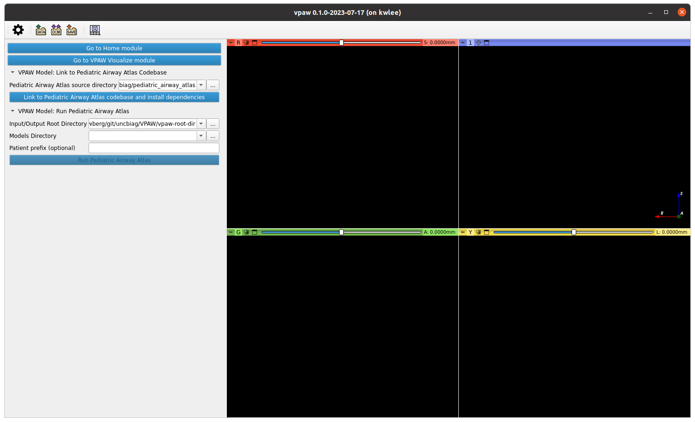

The Virtual Pediatric Airways Workbench (VPAW) is an application, based upon 3D
Slicer, for creating and visualizing anatomically accurate, three-dimensional
airway models for geometric and computational fluid dynamics analyses. Here we
describe two of its modules, VPAW Model and VPAW Visualize.

The **VPAW Model** module provides a graphical user interface so that the user
can easily install, configure, and run the pipelines from the
`pediatric_airway_atlas` repository. The pipeline starts with one CT image and
one set of landmarks per patient and produces a variety of additional images,
landmarks, segmentations, areas, centerlines, and Laplace transforms. These
outputs can be used in comparisons to atlas data.

The **VPAW Visualize** module facilitates the visualization of results produced
by the `pediatric_airway_atlas` pipelines. This module allows researchers to
visualize and overlay intermediate and final outputs for a patient.

# The VPAW Model module

When you start VPAW you start on the Home screen. To run the Pediatric Airway
Atlas pipeline, first click on the "Go to VPAW Model module" button.

You need to specify the directory containing the source code for the Pediatric
Airway Atlas model. Click on the "**...**" button that is to the right of
"Pediatric Airway Atlas source directory."

Use the dialog box to select the directory that contains your source code. This
is the top-level directory of the `uncbiag/pediatric_airway_atlas` git
repository on your local computer. Click the "Choose" button.

You are returned to the VPAW Model screen. Click on the "Link to Pediatric
Airway Atlass codebase and install dependencies" button to tell VPAW that you
want to use the selected source code and install any required Python packages.
Note that these packages need to be installed only once and they are installed
to a Python environment that is internal to VPAW; they are not installed to
Python environments that you use outside of VPAW.

If there are missing Python dependencies, you see a dialog box like the
following. Click the "Yes" button.

Upon completion of the installation of the Python dependencies, you are alerted
to the version numbers of the successfully installed Python packages. Click the
"OK" button.

Whether or not there were dependencies that needed to be installed, you are
notified that VPAW is now connected to the Pediatric Airway Atlas source code
that you supplied. Click the "OK" button.

Next you need to specify the directory that contains your inputs to be processed
by the pipeline. This directory has a Microsoft Excel file called
FilteredControlBlindingLogUniqueScanFiltered.xls and two subdirectories, images
and landmarks. The images subdirectory has one `PPPP\_INPUT.nrrd` file per
patient, where `PPPP` is a four-digit patient number. The landmarks subdirectory
has one `PPPP\_LANDMARKS.fcsv` file for each of the same patient numbers.

The FilteredControlBlindingLogUniqueScanFiltered.xls file of clinical data by
patient and the image files must be supplied. The landmarks files must be
pre-computed prior to running these pipelines. The directory we are using in
this example has inputs for two patients, 1127 and 1129.

Click on the "..." button that is to the right of "Input/Output Root Directory."

Use the dialog box to select the directory that contains your inputs. Click the
"Choose" button.

You are returned to the VPAW Model screen. Next you need to specify the
directory that contains the model parameters that the pipeline should use when
processing the input data. The directory should contain a single file with a
name like "116(158.10-38.AM.24.Mar).pth".

Click on the "..." button that is to the right of "Models Directory."

Use the dialog box to select the directory that contains your model file. Click
the "Choose" button.

You are returned to the VPAW Model screen.

Optionally specify a patient number. If you leave this blank, all patients are
processed. In this example, we specify patient 1127. Whether or not you specify
a patient number, click on the "Run Pediatric Airway Atlas" button.

After the Pediatric Airway Atlas pipeline has completed, you see a dialog box
indicating that. Click on the "OK" button.

You are returned to the VPAW Model screen. An examination of the input/output
directory now shows both the inputs and the newly generated outputs.

# The VPAW Visualize module

To look at the inputs and outputs, we use the VPAW Visualize screen. Click on
the "Go to VPAW Visualize module" button near the upper left corner.

You are taken to the VPAW Visualize screen. To visualize the data just analyzed
by the pipeline or any previous dataset, we enter the location of the dataset.
Click on the "..." button that is to the right of "Data directory."

Use the dialog box to select the directory that contains your data to be
visualized. Click the "Choose" button.

You are returned to the VPAW Visualize screen.

Specify the patient number for the data you wish to visualize. In this example,
we specify patient 1127. Click on the "Show" button.

The VPAW Visualize page now lists a number of data features that can be
visualized. Click on the "Compute Isosurfaces" button to generate a model node
consisting of isosurfaces of the Laplace solution image.

Notice the letters "S" (red), "A" (green), and "L" (yellow) to the right of the
corresponding sliders in the main viewing panels, which indicate superior,
anterior, and left. You adjust the red, green, and yellow sliders to specify
which axial plane (inferior to superior), coronal plane (posterior to anterior),
and sagittal plane (right to left) of the data are displayed. Toggle the
visibility of each element in the scene by toggling the eye icon in the second
column of the list of inputs and outputs.

Let’s tour through the elements one at a time. Looking at just the landmarks
"`1127_LANDMARKS`" shows this information.

Looking at just the input CT scan "`1127_INPUT`" shows this information.

Looking at just the airway segmentation "`Segment_1`" shows this information.

Looking at just "`1127_MARKED`" shows this information.

Looking at just "`1127_UNITIZED_SEGMENTATIONS`" shows this information.

Looking at just the Laplace solution "`1127_SOL`" shows this information.

Looking at just the restricted Laplace solution
"`1127_SOLrestrictedToSegmentation`" shows this information.

Looking at just the airway centerline "`Centerline`" shows this information.

The combination of several visualizations produces rich images.

